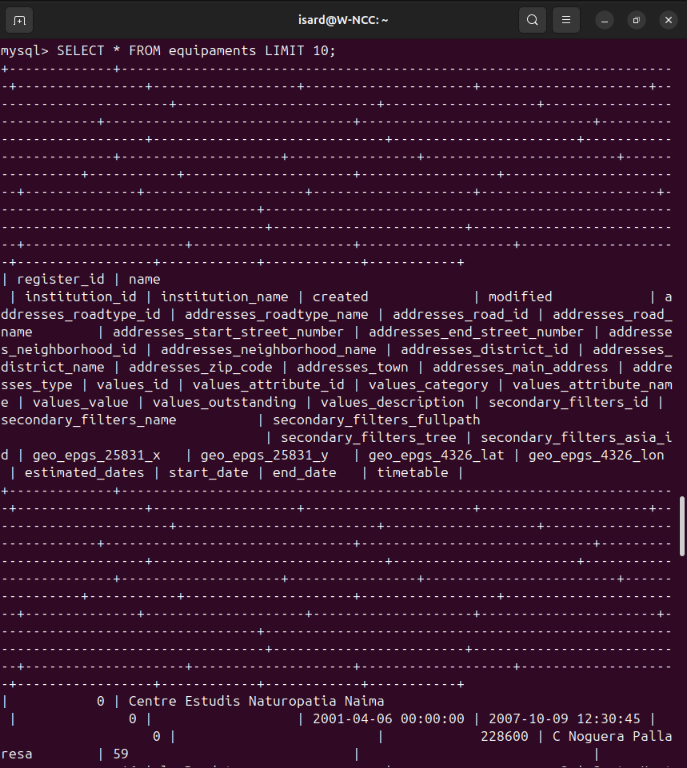

## Descargar un archivo CSV desde portal OpenData

`wget "https://opendata-ajuntament.barcelona.cat/data/dataset/[...]/download" -O educacio_bcn.csv`

Este comando descarga el archivo y lo guarda como educacio_bcn.csv en el directorio actual.

## Visualizar las primeras líneas del archivo CSV

`head -5 educacio_bcn.csv`

Esto muestra las primeras 5 líneas del archivo, permitiéndote inspeccionar el formato y visualización de los datos.

## Convertir el archivo CSV a UTF-8

`iconv -f UTF-16 -t UTF-8 ~/Baixades/educacio_bcn.csv -o ~/Baixades/educacio_bcn_utf8.csv`

Esto genera un nuevo archivo en UTF-8, listo para trabajar en la mayoría de aplicaciones y bases de datos.

## Instalar MySQL

`sudo apt install mysql-server`

Instala el servidor de bases de datos MySQL usando permisos de administrador. Si el paquete ya está instalado, el sistema lo notificará y mantendrá la versión más reciente.

## Habilitar MySQL

`sudo systemctl enable mysql`

Configura MySQL para que se inicie automáticamente al encender el sistema.

## Arrancar el servicio inmediatamente y comprobar el estado MySQL.

`sudo systemctl start mysql`

La imagen muestra cómo habilitar y arrancar el servicio MySQL desde la terminal usando los comandos anteriores. El sistema confirma que MySQL se añadirá al arranque automático tras reiniciar y que el servicio se ha iniciado correctamente.

`sudo systemctl status mysql`

Revisa el estado del servicio para verificar si está activo y corriendo sin errores.

## Acceder a MySQL y mostrar tablas de la base de datos

`mysql -u bchecker -p`

Después de acceder, selecciona la base de datos y muestra las tablas disponibles:

`USE barcelona_educacio;
SHOW TABLES;`

La imagen muestra el acceso a MySQL, el cambio a la base de datos barcelona_educacio y la lista de tablas existentes, donde aparece equipaments.

## Visualizar la estructura de la tabla equipaments

`DESCRIBE equipaments;`

La captura enseña la estructura de la tabla equipaments, mostrando cada campo, su tipo de datos, si permite NULL, si es clave primaria o secundaria, valores predeterminados y atributos extra.

## Consultar registros de la tabla equipaments

`SELECT * FROM equipaments LIMIT 10;`

Esta imagen muestra el resultado del comando SQL que extrae un máximo de 10 registros de la tabla equipaments, mostrando todas sus columnas y algunos datos de ejemplo.

