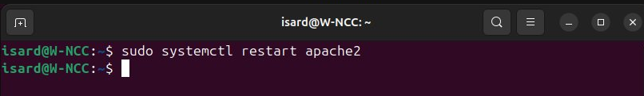

## Instalación de Apache2
`sudo apt install -y apache2`

Instala el servidor web Apache2 de forma automática (sin pedir confirmación) usando permisos de administrador. Si ya está instalado, confirma que está actualizado.

## Habilitar y arrancar Apache
`sudo systemctl enable apache2` configura Apache2 para que se inicie automáticamente con el sistema.
`sudo systemctl start apache2` arranca el servicio Apache2 inmediatamente.

## Verificar estado del servidor Apache
sudo systemctl status apache2 

## Reiniciar Apache tras cambios de configuración
`sudo systemctl restart apache2`

